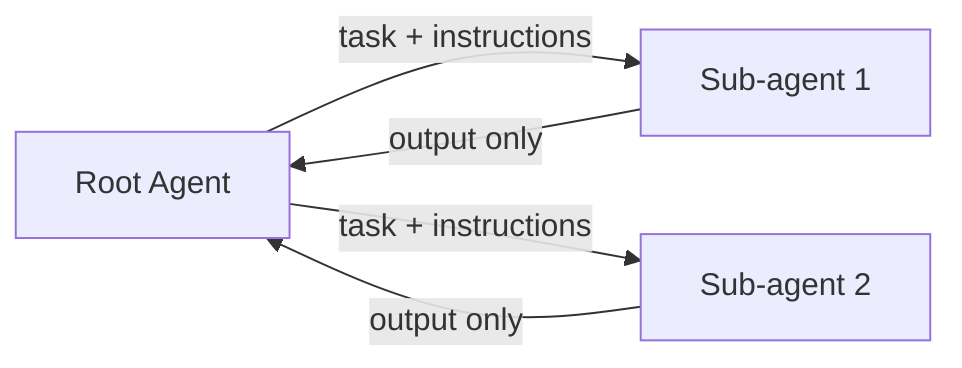

# Sub-agents

Delegate tasks to other agents. Each sub-agent gets its own isolated context, preventing bloat in your main conversation.

## The Problem

As you work with an agent, context accumulates. Files get read, conversations grow, instructions stack up. Eventually you hit diminishing returns: the agent has too much to track and starts losing focus.

## The Solution

Spawn a sub-agent for specific tasks. The sub-agent:

- Starts with a fresh context
- Gets only the instructions you provide
- Executes independently
- Returns only its output to the root agent

The root agent never sees the sub-agent's internal context. Just the result.

## Single Agent vs Sub-agents

| Aspect | Single Agent | Sub-agents |
|--------|--------------|------------|
| Context | Accumulates everything | Each agent has isolated context |
| Specialization | One agent does all tasks | Each sub-agent can have focused instructions |
| Output control | All intermediate work visible | Root only sees final outputs |
| Token usage | Grows with conversation | Distributed across agents |

## When to Use Sub-agents

Good candidates for delegation:

- **Distinct subtasks** - Refactoring file A while also writing tests for file B
- **Different specializations** - One agent for backend, another for frontend
- **Crowded context** - Your main conversation is getting long and unfocused
- **Parallel work** - Tasks that don't depend on each other

## How It Works

1. Root agent identifies a task suitable for delegation
2. Root spawns a sub-agent with specific instructions
3. Sub-agent executes with its own fresh context
4. Sub-agent completes and returns output
5. Root receives only the output, not the sub-agent's full context

## Key Insight

Instructions flow down. Only outputs flow back up.

This is what prevents context bloat. The root agent stays lean because it never inherits the sub-agent's working memory.

## In Practice

Different tools implement sub-agents differently:

- **Claude Code** - Background agents run tasks in parallel
- **Cursor** - Agent mode can spawn sub-tasks (tool dependent)
- **Custom setups** - Orchestration layers that manage multiple agent instances

The pattern is the same: delegate, isolate, return results.
