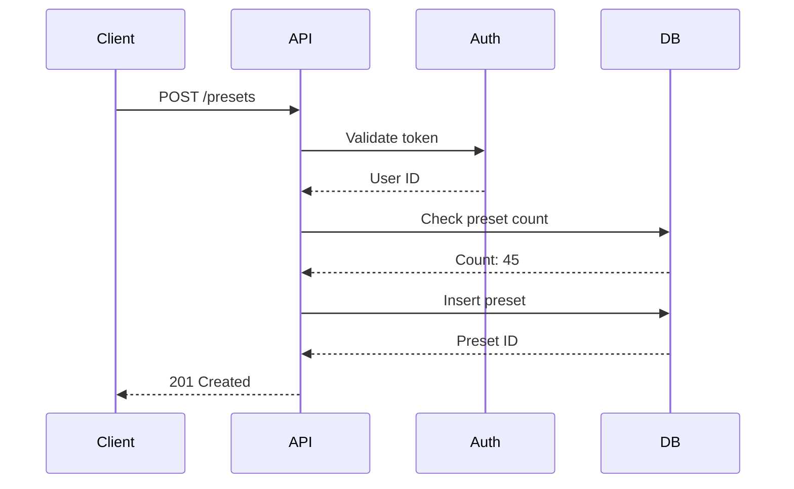
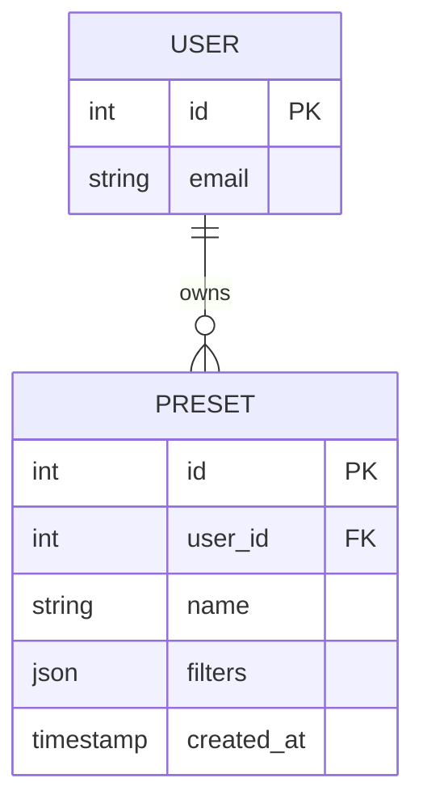
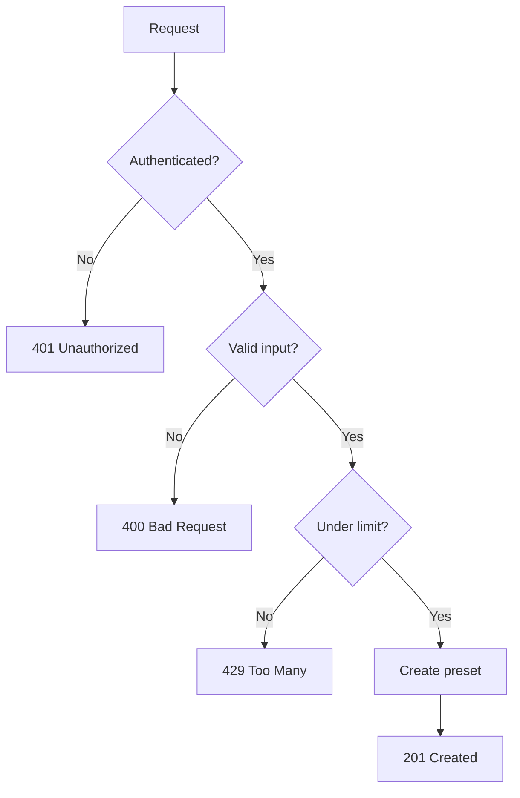

# Design

Architecture decisions, data structures, flows, and interfaces. Design is the HOW.

## What Goes in Design

| Category | Content |
|----------|---------|
| Diagrams | Sequence diagrams, ERD, flowcharts |
| Data structures | Types, interfaces, schemas |
| API contracts | Endpoints, request/response formats |
| Decisions | Technology choices with rationale |

## Diagrams with Mermaid

Use Mermaid for diagrams. Agents can read and generate them.

### Sequence Diagram



### Entity Relationship Diagram



### Flowchart



## Data Structures

Define your types clearly:

```typescript
interface Preset {
  id: number
  userId: number
  name: string
  filters: FilterData
  createdAt: Date
  updatedAt: Date
}

interface FilterData {
  query: string
  status: string[]
  dateRange: {
    start: Date
    end: Date
  }
}

interface CreatePresetRequest {
  name: string
  filters: FilterData
}

interface CreatePresetResponse {
  id: number
  name: string
  createdAt: Date
}
```

## API Contracts

Define endpoints precisely:

```markdown
## API Endpoints

### Create Preset
- **POST** `/api/presets`
- **Auth**: Required
- **Request Body**: `CreatePresetRequest`
- **Response**: `201 Created` with `CreatePresetResponse`
- **Errors**:
  - `400` - Invalid input
  - `401` - Not authenticated
  - `429` - Preset limit reached

### List Presets
- **GET** `/api/presets`
- **Auth**: Required
- **Response**: `200 OK` with `Preset[]`

### Delete Preset
- **DELETE** `/api/presets/:id`
- **Auth**: Required (must own preset)
- **Response**: `204 No Content`
- **Errors**:
  - `404` - Preset not found
  - `403` - Not owner
```

## Design Decisions

Document choices with rationale:

```markdown
## Decisions

### Database: PostgreSQL
- Already in our stack
- JSONB support for flexible filter storage
- Strong consistency for user data

### API Style: REST
- Simpler than GraphQL for CRUD operations
- Fits our existing patterns
- Easier to cache

### Validation: Zod
- Runtime validation with TypeScript inference
- Already used in other services
- Good error messages
```

## Design Template

```markdown
# Design: [Feature Name]

## Overview
[One paragraph summary of the design]

## Data Model

[ERD diagram or type definitions]

## API Design

[Endpoint specifications]

## Sequence Flows

[Key flows as sequence diagrams]

## Decisions

| Decision | Choice | Rationale |
|----------|--------|-----------|
| Database | Postgres | Already in stack, JSONB support |
| Cache | Redis | Need distributed cache |

## Open Questions

- [Any unresolved design questions]
```

## Keep Design Proportional

Simple feature? Minimal design:
- Data types
- API endpoint
- Done

Complex feature? Full design:
- Diagrams
- All data structures
- API contracts
- Decision log

Match the design effort to the complexity.

:::tip
The agent can help generate design docs. Start with requirements, ask the agent to propose a design, then refine together.
:::
